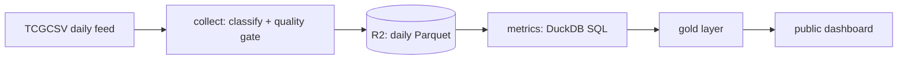

# Sealed Pulse

A daily price tracker for English sealed Pokémon TCG product (booster boxes,
Elite Trainer Boxes, booster bundles, packs and collections), built as an
AI-assisted engineering project with Claude.

**Live dashboard:** the GitHub Pages link in this repository's About panel.
It updates every day after TCGplayer's prices refresh.

## What it does

- Collects TCGplayer market prices for about 3,000 sealed products once a day
  from [TCGCSV](https://tcgcsv.com), the free public mirror of TCGplayer's
  catalog, and stores each day as one write-once Parquet file in Cloudflare R2.
- Separates real sealed product from the hundreds of unnumbered cards that
  look like it in the raw feed.
- Computes trend and risk metrics that are robust to single bad prints and to
  preorder pricing, and ranks the products that most need attention.
- Publishes this dashboard: the most relevant products, their attention flags,
  a price chart per product and set-level returns.

## How it was built with AI

The project was planned and built in conversation with Claude, with a person
making the product and data-source decisions. The process:

1. **Research.** A survey of sealed-price data sources and their terms of use,
   and a code review of three open-source trackers.
2. **A decisions log.** Every design choice was written down with its owner
   (the person or Claude) and its reason, before any code was written.
3. **Test-first code.** Every module was written against tests first; the
   plan was rebuilt from its own text and re-run to prove it was complete.
4. **Validation on real data.** Running the pipeline on real prices exposed
   bugs that synthetic tests had not:
   - a naive "sealed product" rule admitted 551 cards, 16% of its output;
   - a single bad price print inflated one ETB's drawdown from −18% to −28%;
   - preorder prices made a newly released set look −90% over 90 days;
   - `ASOF` turned out to be a reserved word in DuckDB.

   Each became a regression test.

## What is in this repository

This is a showcase copy of the plumbing and presentation code: the TCGCSV
client, storage layer, quality gate, snapshot builder, collector, dashboard
renderer and their tests. The metric definitions, product classifier,
curated product data and the underlying price history are kept in a private
repository, so this copy is for reading rather than running.

## Data and attribution

Prices are TCGplayer market prices, mirrored by TCGCSV. History from before
this project's own daily collection began comes from the open-source
[etfhanstorz/pokemon-tracker](https://github.com/etfhanstorz/pokemon-tracker)
project, used with credit and marked as seed data on the page; it will be
removed at the author's request. Nothing here is financial advice.
